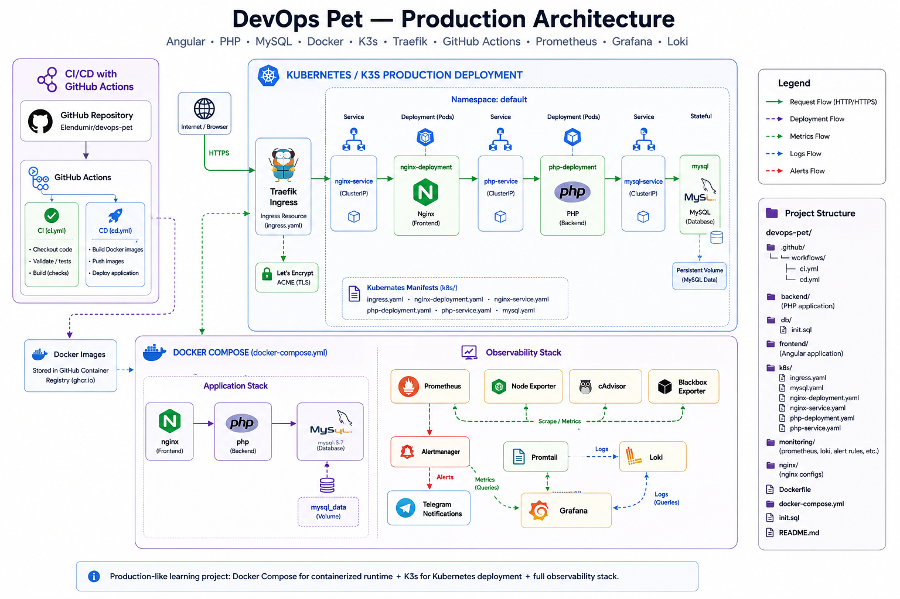
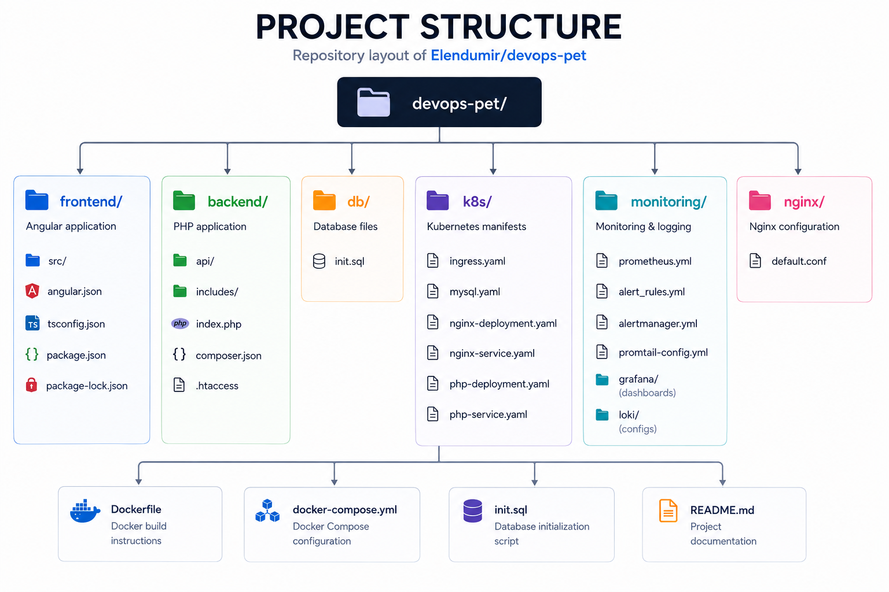
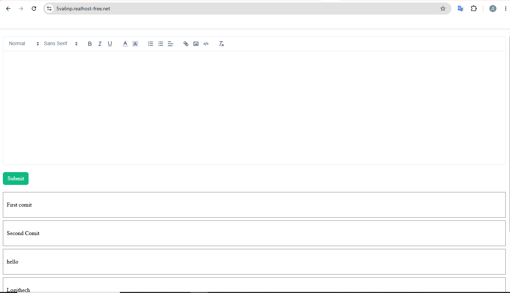
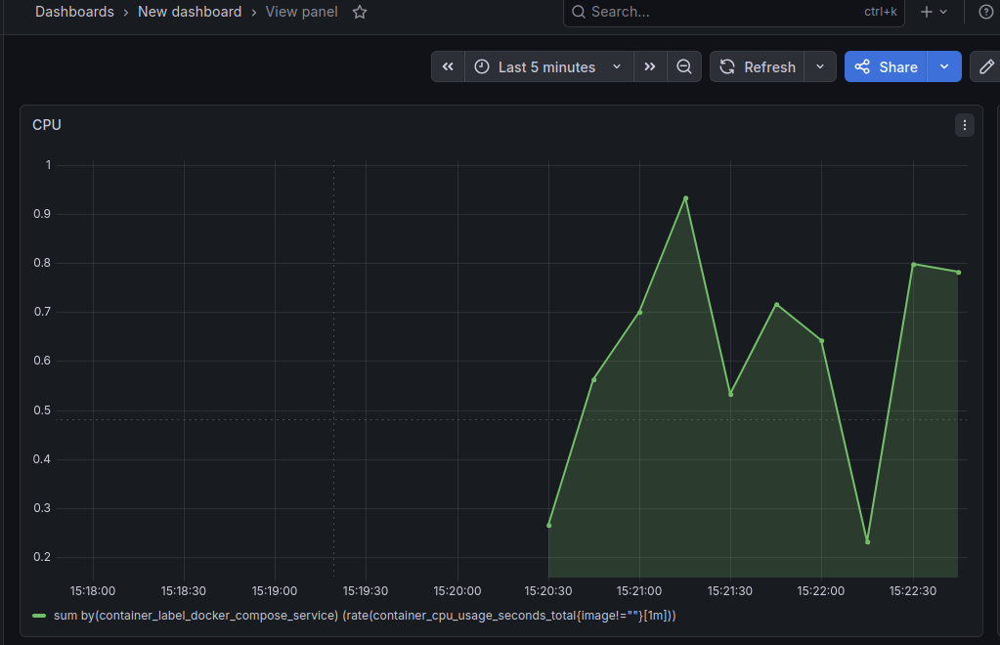
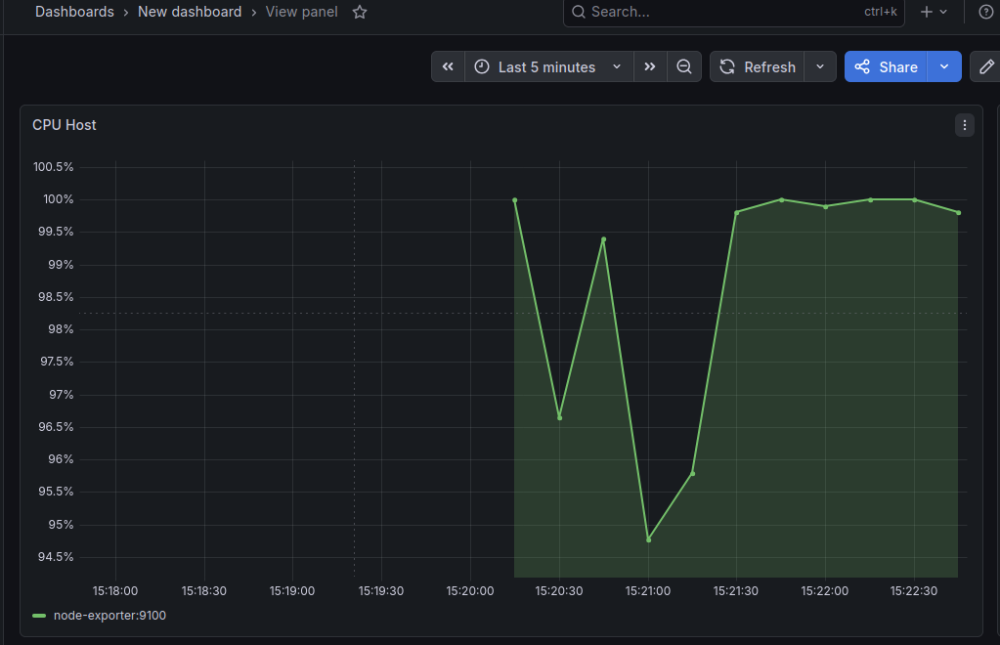
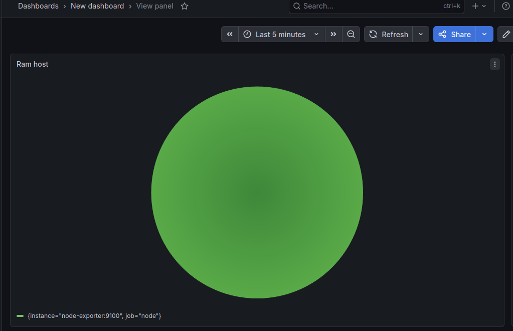
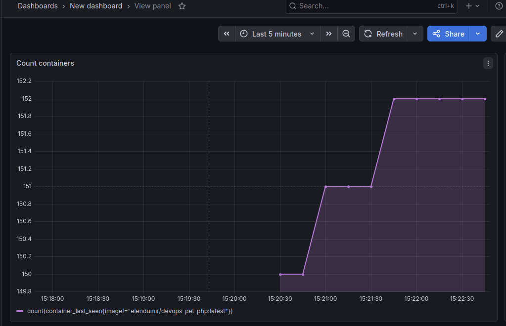
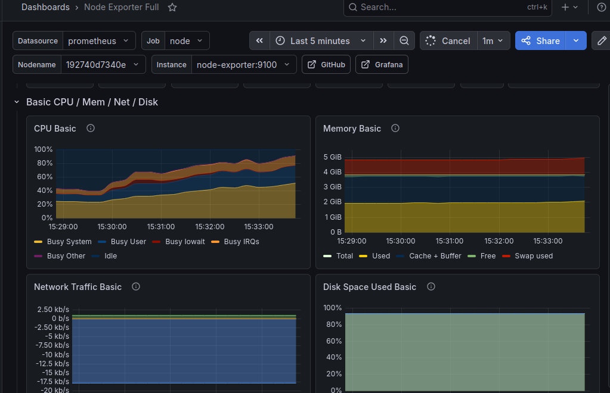

## DevOps Pet Project

This project demonstrates a complete DevOps workwlow for deploying and monitoring a full-stack application.
A simple full-stack web application that allows users to submit and store comments. The application includes:

- Angular frontend
- PHP backend
- My SQL database
- Docker containerization
- Kubernetes deployment with k3s
- HTTPS with Let's Encrypt
- Monitoring and logging stack
- CI/CD pipeline for Docker Compose

## Live Demo

https://www.5va6np.realhost-free.net

## Architecture




## Technology Stack


 | Area                      | Technologies            |
| ------------------------- | ----------------------- |
| Frontend                  | Angular, Nginx          |
| Backend                   | PHP                     |
| Database                  | MySQL                   |
| Containers                | Docker, Docker Compose  |
| Orchestration             | Kubernetes, K3s         |
| Ingress                   | Traefik                 |
| TLS                       | Let's Encrypt, ACME     |
| CI/CD                     | GitHub Actions          |
| Metrics                   | Prometheus              |
| Visualization             | Grafana                 |
| Logging                   | Loki, Promtail          |
| Alerting                  | Alertmanager, Telegram  |
| Infrastructure monitoring | Node Exporter, cAdvisor |
| Endpoint monitoring       | Blackbox Exporter       |


## Docker

The frontend is delivered as static Angular build files and served through Nginx.

Containers used in the project:

- nginx frontend container
- php backend container
- mysql database
- monitoring stack

## Kubernetes

The application is deployed to a lightweight K3s Kubernetes cluster.
Kubernetes resources are defined as plain YAML manifests in the k8s/ directory.
Traefik is used as the ingress controller.

Kubernetes resources:
Nginx Deployment
Nginx Service
PHP Deployment
PHP Service
MySQL configuration
Ingress

Deploy to Kubernetes

```bash
gh repo clone Elendumir/devops-pet
cd devops-pet
cd k8s
kubectl apply -f .
```


## HTTPS/TLS

External traffic is served over HTTPS using:

Traefik as the Kubernetes Ingress Controller
Let's Encrypt for certificates
ACME for certificate issuance

This allows the application to obtain and use trusted TLS certificates instead of relying on manually generated certificates.

## Monitoring & Observability

The project includes both metrics and centralized logging.

**Metrics**

Prometheus collects metrics from the infrastructure and monitoring exporters.

Metrics sources include:

Node Exporter — host-level metrics
cAdvisor — container metrics
Blackbox Exporter — HTTP endpoint availability
Visualization

Grafana is used to visualize the collected metrics through dashboards.

Example dashboard information includes:

- CPU usage
- host CPU usage
- RAM usage
- container count
- Node Exporter metrics

**Logging**

Container logs are collected by Promtail and sent to Loki.
Docker containers
       │
       ▼
    Promtail
       │
       ▼
      Loki
       │
       ▼
    Grafana

**Alerting**

Prometheus evaluates alert rules and sends firing alerts to Alertmanager.
Prometheus
    │
    ▼
Alertmanager
    │
    ▼
 Telegram


## Project Structure




## Screenshots

### Aplications

App on VPS



### Grafana

Here You can see dashbords from Grafana which includes:
- Cpu
 
- Cpu host

- Ram host

- Number of containers

- Node Exporter


   
## Troubleshooting Experience

During development and deployment the following issues were debugged:

- Kubernetes ingress routing
- Traefik TLS configuration
- Let's Encrypt certificate generation
- Docker networking
- Nginx reverse proxy issues
- HTTPS validation problems
- Kubernetes service communication
The troubleshooting experience was an important part of the project because the goal was not only to deploy the stack, but also to understand how to diagnose failures across different layers.


## Future Improvements
- Helm charts
- Production cloud deployment
- Automated rollback strategy

## Result

This project demonstrates a production-like DevOps environment with:

- containerized services
- Kubernetes orchestration
- HTTPS security
- monitoring and alerting
- centralized logging
- CI/CD pipeline
